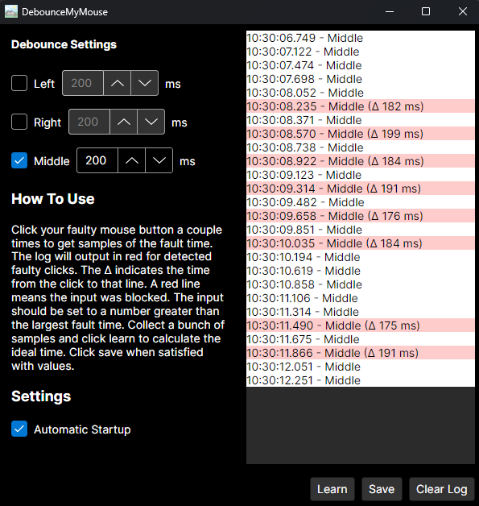

##### Debounce My Mouse
This app is for fixing faulty mouse switches in software. I build this because I had a Razer Naga Pro that failed on the scroll wheel and failed on the scroll wheel click. Whenever I would browse the internet and use the middle mouse button to open a new tab it would open three. 
When I used the middle mouse button to close a tab it would tripple close adjacent ones. I made this to help fix that issue.

